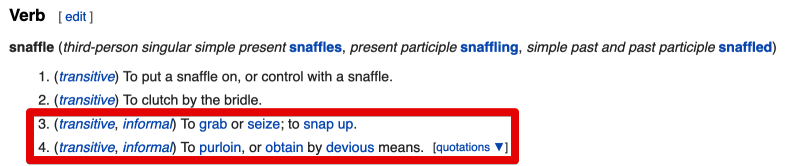
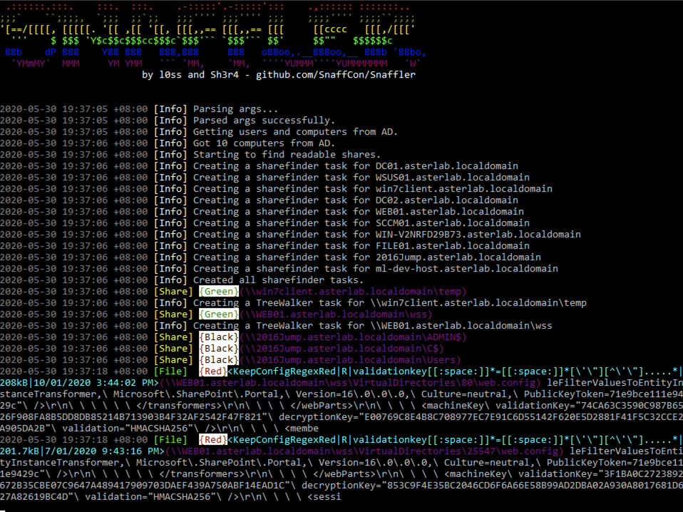
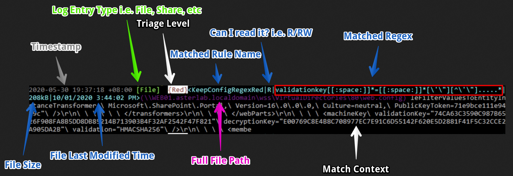

# Snaffler 

[](https://ko-fi.com/T6T31VEVJ)



## What is it for? 

Snaffler is a tool for **pentesters** to help find delicious candy needles (creds mostly, but it's flexible) in a bunch of horrible boring haystacks (a massive Windows/AD environment).

It might also be useful for other people doing other stuff, but it is explicitly NOT meant to be an "audit" tool.

## I don't want to read all this!!!

Ugh, fine. But we aren't responsible for the results. We wrote all this other stuff for you, but that's okay. We're not mad, just disappointed.

`snaffler.exe  -s -o snaffler.log`

## What does it do?

It gets a list of Windows computers from Active Directory, then spreads out its snaffly appendages to them all to figure out which ones have file shares, and whether you can read them. 

Then YET MORE snaffly appendages enumerate all the files in those shares and use **L**EARNED **A**RTIFACTUAL **I**NTELLIGENCE for **M**ACHINES to figure out which ones a grubby little hacker like you might want. 

Actually it doesn't do any ML stuff (yet), because doing that right would require training data, and that would require an enormous amount of time that we don't have.

## What does it look like?

Like this (mostly)!

<p align="center">
  
</p>

## How do I use it?

If you "literally just run the EXE on a domain joined machine in the context of a domain user" (as people were instructed to do with Grouper2, immediately before they ran it with all the verbose/debug switches on so it screamed several hundred megabytes of stack traces at them) it will basically do nothing. This is our idea of a prank<sup>TM</sup> on people who don't read README files, because we're monsters.

HOWEVER... if you add the correct incantations, it will enable the aforementioned L.A.I.M. and the file paths where candy may be found will fall out. 

The key incantations are: 

`-o`   Enables outputting results to a file. You probably want this if you're not using `-s`. e.g. `-o C:\users\thing\snaffler.log`

`-s`   Enables outputting results to stdout as soon as they're found. You probably want this if you're not using `-o`.

`-v`   Controls verbosity level, options are Trace (most verbose), Debug (less verbose), Info (less verbose still, default), and Data (results only). e.g `-v debug` 

`-m`   Enables and assigns an output dir for snaffler to automatically take a copy of (or Snaffle... if you will) any found files that it likes.

`-l`   Maximum size of files (in bytes) to Snaffle. Defaults to 10000000, which is *about* 10MB.

`-b`   Interest level to report from 0 to 3. `0` will report all matches, `3` will report critical matches only.

`-i`   Disables computer and share discovery, requires a path to a directory in which to perform file discovery.

`-d`   Domain to search for computers to search for shares on to search for files in. Easy.

`-c`   Domain controller to query for the list of domain computers.

`-r`   The maximum size file (in bytes) to search inside for interesting strings. Defaults to 500k.

`-j`   How many bytes of context either side of found strings in files to show, e.g. `-j 200`

`-z`   Path to a config file that defines all of the above, and much much more! See below for more details. Give it `-z generate` to generate a sample config file called `.\default.toml`.

## What does any of this log output mean?

Hopefully this annotated example will help:

<p align="center">
  
</p>

This log entry should be read roughly from left to right as:

* at 7:37ish
* Snaffler found a file it thinks is worth your attention
* it's rated it "Red", the second most-interesting level
* it matched a rule named "KeepConfigRegexRed"
* you can read it, but not modify it
* the exact regex that was matched is that stuff in the red box
* it's 208kB
* it was last modified on January 10th 2020 at quarter-to-four in the afternoon.
* the file may be found at the path in purple

... and the rest of the line (in grey) is a little snippet of context from the file where the match was.

In this case we've found ASP.NET validationKey and decryptionKey values, which might let us RCE the web app via some deserialisation hackery. Hooray!

## How does it decide which files are good and which files are boring?

### The simple answer:
Each L.A.I.M. magic file finding method does stuff like:

* Searching by exact file extension match, meaning that any file with an extension that matches the relevant wordlist will be returned. This is meant for **file extensions** that are almost always going to contain candy, e.g. `.kdbx`, `.vmdk`, `.ppk`, etc.

 - Searching by (case insensitive) exact filename match. This is meant for **file names** that are almost always going to contain candy, e.g. `id_rsa`, `shadow`, `NTDS.DIT`, etc.

 - Searching by exact file extension match (yet another wordlist) FOLLOWED BY 'grepping' the contents of any matching files for certain key words (yet yet another another wordlist). This is meant for file extensions that **sometimes** contain candy but where you know there's likely to be a bunch of chaff to sift through. For example, `web.config` will sometimes contain database credentials, but will also often contain boring IIS config nonsense and no passwords. This will (for example) find anything ending in `.config`, then will grep through it for strings including but not limited to: `connectionString`, `password`, `PRIVATE KEY`, etc.

 - Searching by partial filename match (oh god more wordlists). This is mostly meant to find `Jeff's Password File 2019 (Copy).docx` or `Privileged Access Management System Design - As-Built.docx` or whatever, by matching any file where the name contains the substrings `passw`, `handover`, `secret`, `secure`, `as-built`, etc.

 - There's also a couple of skip-lists to skip all files with certain extensions, or any file with a path containing a given string.

### The real answer:

Snaffler uses a system of 'classifiers', which allow the end-user (you) to define (relatively) simple rules that can be combined and strung together and mangled however you see fit. It comes with a set of default classifiers, which you can see by either looking at the code or by having a look at the config file created by `-z generate`, so the best place to start with making your own is to edit those.

Here's some annotated examples that will hopefully help to explain things better. If this seems very hard, you can just use our rules and they'll probably find you some good stuff.

This is an example of a rule that will make Snaffler ignore all files and subdirectories below a dir with a certain name.
```python
[[Classifiers]]
EnumerationScope = "DirectoryEnumeration" # This defines which phase of the discovery process we're going to apply the rule. 
                                          # In this case, we're looking at directories. 
                                          # Valid values include ShareEnumeration, DirectoryEnumeration, FileEnumeration, ContentsEnumeration
RuleName = "DiscardFilepathContains" # This can be whatever you want. We've been following a rough "MatchAction, MatchLocation,
                                     # MatchType" naming scheme, but you can call it "Stinky" if you want. ¯\_(ツ)_/¯
MatchAction = "Discard" # What to do with things that match the rule. In this case, we want to discard anything that matches this rule.
                        # Valid options include: Snaffle (keep), Discard, Relay (example of this below), and CheckForKeys (example below).
MatchLocation = "FilePath" # What part of the file/dir/share to look at to check for a match. In this case we're looking at the whole path.
                           # Valid options include: ShareName, FilePath, FileName, FileExtension, FileContentAsString, FileContentAsBytes,
                           # although obviously not all of these will apply in all EnumerationScopes.
WordListType = "Contains" # What matching logic to apply, valid options are: Exact, Contains, EndsWith, StartsWith, or Regex.
WordList = ["winsxs", "syswow64"] # A list of strings or regex patterns to use to match. If using regex matterns, WordListType must be Regex.
Triage = "Green" # If we find a match, what severity rating should we give it. Valid values are Black, Red, Yellow, Green. Gets ignored for Discard anyway.
```

This rule on the other hand will look at file extensions, and immediately discard any we don't like.

In this case I'm mostly throwing away fonts, images, CSS, etc.
```python
[[Classifiers]]
EnumerationScope = "FileEnumeration" # We're looking at the actual files, not the shares or dirs or whatever.
RuleName = "DiscardExtExact" # just a name
MatchAction = "Discard" # We're discarding these
MatchLocation = "FileExtension" # This time we're only looking at the file extension part of the file's name.
WordListType = "Exact" # and we only want exact matches. 
WordList = [".bmp", ".eps", ".gif", ".ico", ".jfi", ".jfif", ".jif", ".jpe", ".jpeg", ".jpg", ".png", ".psd", ".svg", ".tif", ".tiff", ".webp", ".xcf", ".ttf", ".otf", ".lock", ".css", ".less"] # list of file extensions.
```

Here's an example of a really simple rule for stuff we like and want to keep.
``` python
[[Classifiers]]
EnumerationScope = "FileEnumeration" # Still looking at files
RuleName = "KeepExtExactBlack" # Just a name
MatchAction = "Snaffle" # This time we are 'snaffling' these. This usually just means send it to the UI, 
                       # but if you turn on the appropriate option it will also grtab a copy.
MatchLocation = "FileExtension" # We're looking at file extensions again
WordListType = "Exact" # With Exact Matches
WordList = [".kdbx", ".kdb", ".ppk", ".vmdk", ".vhdx", ".ova", ".ovf", ".psafe3", ".cscfg", ".kwallet", ".tblk", ".ovpn", ".mdf", ".sdf", ".sqldump"] # and a bunch of fun file extensions.
Triage = "Black" # these are all big wins if we find them, so we're giving them the most severe rating.
```

This one is basically the same, but we're looking at the whole file name. Simple!
``` python
[[Classifiers]]
EnumerationScope = "FileEnumeration"
RuleName = "KeepFilenameExactBlack"
MatchAction = "Snaffle"
MatchLocation = "FileName"
WordListType = "Exact"
WordList = ["id_rsa", "id_dsa", "NTDS.DIT", "shadow", "pwd.db", "passwd"]
Triage = "Black"
```

This one is a bit nifty, check this out...
```python
[[Classifiers]]
EnumerationScope = "FileEnumeration" # we're looking for files...
RuleName = "KeepCertContainsPrivKeyRed" 
MatchLocation = "FileExtension" # specifically, ones with certain file extensions...
WordListType = "Exact"
WordList = [".der", ".pfx"] # specifically these ones...
MatchAction = "CheckForKeys" # and any that we find, we're going to parse them as x509 certs, and see if the file includes a private key!
Triage = "Red" # cert files aren't very sexy, and you'll get huge numbers of them in most wintel environments, but this check gives us a way better SNR!
```

OK, here's where the REALLY powerful stuff comes in. We got a pair of rules in a chain here.

Files with extensions that match the first rule will be sent to second rule, which will "grep" (i.e. String.Contains()) them for stuff in a specific wordlist. 

You can chain these together as much as you like, although I imagine you'll start to see some performance problems if you get too inception-y with it.
```python
[[Classifiers]]
EnumerationScope = "FileEnumeration" # this one looks at files...
RuleName = "ConfigGrepExtExact"
MatchLocation = "FileExtension" # specifically the extensions...
WordListType = "Exact"
WordList = [".yaml", ".xml", ".json", ".config", ".ini", ".inf", ".cnf", ".conf"] # these ones.
MatchAction = "Relay" # Then any files that match are handed downstream...
RelayTarget = "KeepConfigGrepContainsRed" # To the rule with this RuleName!

[[Classifiers]]
RuleName = "KeepConfigGrepContainsRed" # which is this one! This is why following a naming convention really helps.
EnumerationScope = "ContentsEnumeration" # this one looks at file content!
MatchAction = "Snaffle" # it keeps files that match
MatchLocation = "FileContentAsString" # it's looking at the contents as a string (rather than a byte array)
WordListType = "Contains" # it's using simple matching
WordList = ["password=", " connectionString=\"", "sqlConnectionString=\"", "validationKey=", "decryptionKey=", "NVRAM config last updated"]
Triage = "Red"
```
hopefully you get the idea...


## This sucks, do you have plans to make it suck less?

Very much so.

Next step on the roadmap is a bunch of extra concurrency magic to make everything even more fasterer.

We're also going to: 
 - Add parsing of MS Word and Excel documents.
 - Add parsing of archive files, ideally treating them as just another dir to walk through looking for goodies.
 - Keep refining the rules and regexen. **More words for the wordlists! `string[]`s for the `string` throne!**


## Who did you steal code from?

The share enumeration bits were snaffled (see what I did there?) from SharpShares, which was written by the exceedingly useful Dwight Hohnstein. (https://github.com/djhohnstein/SharpShares/)
Dwight's GitHub profile is like that amazing back aisle at a hardware store that has a whole bunch of tools that make you go "oh man I can't wait til I have an excuse to try this one for realsies..." and you should definitely check it out.

While no code was taken (mainly cos it's Ruby lol) we did steal a bunch of nifty ideas from `plunder2` (http://joshstone.us/plunder2/)

Wordlists were also curated from those found in some other similar-ish tools like trufflehog, shhgit, gitrobber, and graudit.


## Is it OPSEC safe? (Whatever the hell that means)

Pffft, no. It's noisy as fuck.

Look let's put it this way... If it's the kind of environment where you'd feel confident running BloodHound in non-stealth mode, then uhhh, yeah man... It's real stealthy.


## How can I help or get help?

If you want to discuss via Slack you can ping us (@l0ss or @Sh3r4) on the BloodHound Slack, joinable at https://bloodhoundgang.herokuapp.com/, or chat with a group of contributors in the #snaffler channel.

You can also ping us on Twitter - @mikeloss and @sh3r4_hax

Otherwise file an issue; we'll try.
